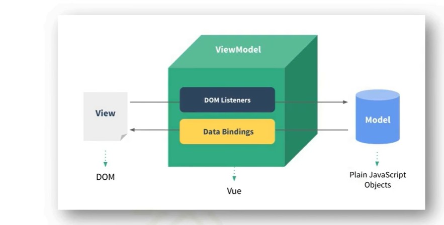
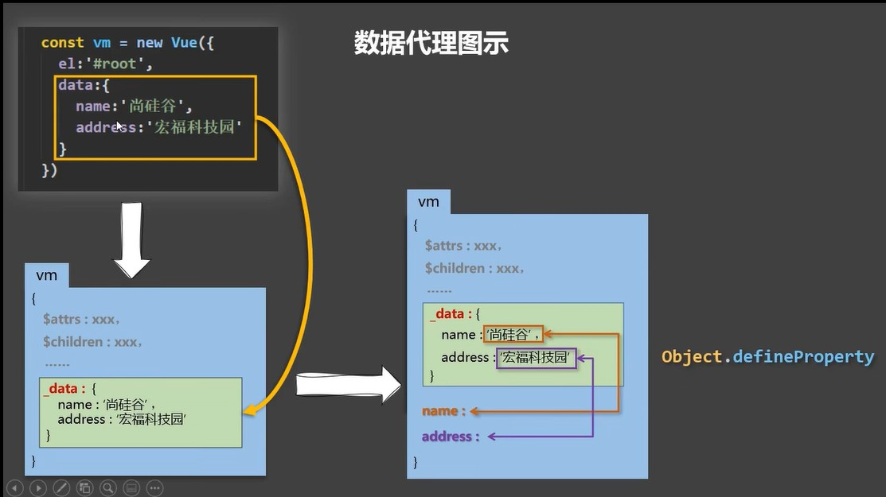

# 一、MVVM模型简介

```markdown
1. M：模型（Model），对应data中的数据

2. V：视图（View），对应html模板

3. VM：视图模型（ViewModel），Vue实例对象

4. 模型与视图是通过vm进行交互的，模型中的所有属性最后都会出现在vm身上

5. vm中的所有属性以及Vue原型上的所有属性，在视图（Vue模板）中都可以直接使用

6. 一旦vm中的数据发生变化，View的效果也会立即发生变化
```




# 二、数据代理

- 通过一个对象代理对另一个对象属性的读写叫做数据代理，一般用Object.defineProperty()完成

  ```markdown
  Vue数据代理的原理
  
  1. 通过vm对象来代理model对象（data数据）中属性的读写操作。
  
  2. model对象（data数据）在vm中是`_data`这个属性，它们的引用都是一样的。
  
  3. data中的数据都会在vm中有一份，是通过Object.defineProperty添加的，并且有一对getter，setter方法，当读写vm中的数据时会通过getter，setter方法操作`_data`中的元数据
  
  ```

  

  