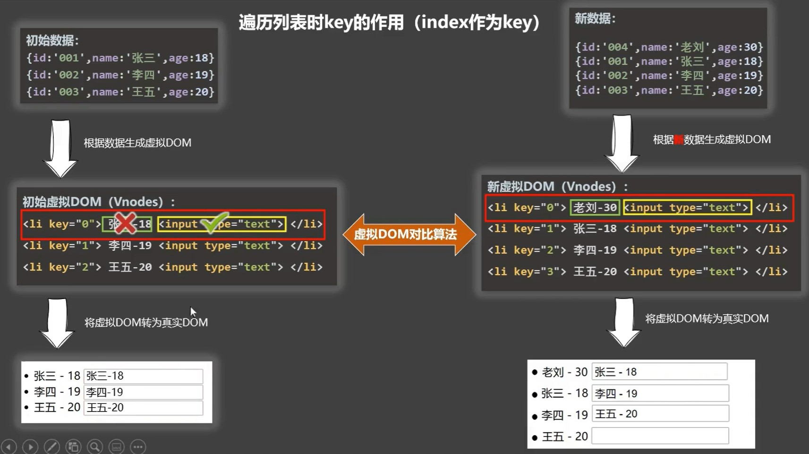

# 一、列表渲染

```markdown
1. v-for用于展示列表数据，渲染列表时，必须带上`:key`属性，为的是标识每一个结构的唯一性


2. 遍历数组
	*写法1：  item in/of items
	*写法2：  (item,index) in/of items


3. 遍历对象。
	*(v,k) in/of obj


4. 遍历字符串
	*(char，index)of/in str
```

```html
<ul>
    <!-- 遍历数组 -->
    <li v-for="(item, index) in persons" :key="index">
        {{item.age}}-{{item.name}}
    </li>

    <!-- 遍历对象 -->
    <li v-for="(value, key) of user" :key="index">
        {{key}}-{{value}}
    </li>

    <!-- 遍历字符串 -->
    <li v-for="(char, index) in str" :key="index">
        {{index}}-{{char}}
    </li>
</ul>


data:{
    persons:[
        {id:'001',name:'lucy',age:14},
        {id:'002',name:'javk',age:10},
        {id:'003',name:'marry',age:19},
    ],
        
    user:{
        username:"HanMeiMei",
        addr:"北京市"
    },
        
    str:"abcd"
}
```


# 二、key的作用与原理

- :key的值是给vue内部用的，不是给开发人员用的，所以在页面结构上看不到key这个属性

- 遍历对象数组时index作为key会产生的问题

  - ```
    当插入顺序被打乱的时候，也就是不按照尾插法加入元素，会产生虚拟dom错乱的问题，影响到真实dom的渲染
    ```

    

  1. 虚拟DOM中key的作用

     - key是虚拟DOM对象的标识，当数据发生变化时，Vue会根据新数据生成新的虚拟DOM，随后Vue进行新虚拟DOM与旧的

       虚拟DOM的差异比较(diff算法)

     - diff算法比较规则：

       ```markdown
       1. 根据新的虚拟DOM中的key找到旧的虚拟DOM中相同的key
       	（1）若是新旧虚拟DOM中的节点不变，则直接复用旧虚拟DOM生成的真实DOM
       	（2）若是新旧的虚拟DOM中的节点改变，则根据新的虚拟DOM直接生成真实DOM，不复用
       	
       2. 根据新的虚拟DOM中的key没有找到旧的虚拟DOM中相同的key 
       	（1）直接根据新的虚拟DOM生成真实DOM
       ```

  2. index最为key会产生的问题		

     ```markdown
     1. 若是对数据进行破坏顺序的操作，乱序添加，乱序删除，会产生没必要的真实DOM更新，界面效果没问题，但是效率极低
     
     2. 如果DOM中还包括输入类的DOM，会产生DOM错误跟新，界面效果出问题
     ```

  3. 开发中如何选择key

     ```markdown
     1. 每条数据的key最好是唯一标识，组好使用id，手机号这类的
     
     2. 如果不存在对数据的逆序添加，删除，排序等破坏顺序的操作，仅仅用于列表渲染展示数据，使用index作为key是没问题的。
     ```

     

**总结：只对数据进行展示key用index，涉及写的操作key用id**


