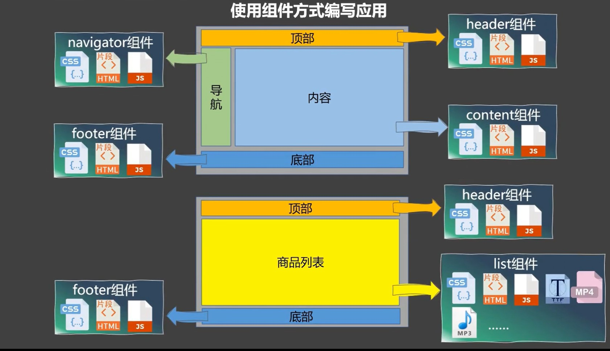
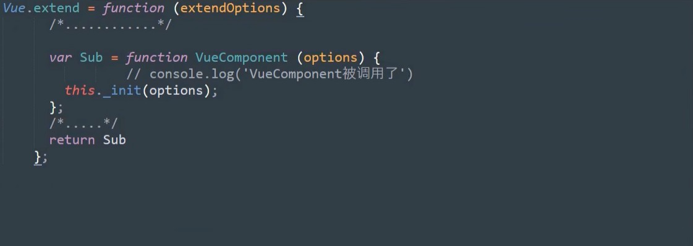
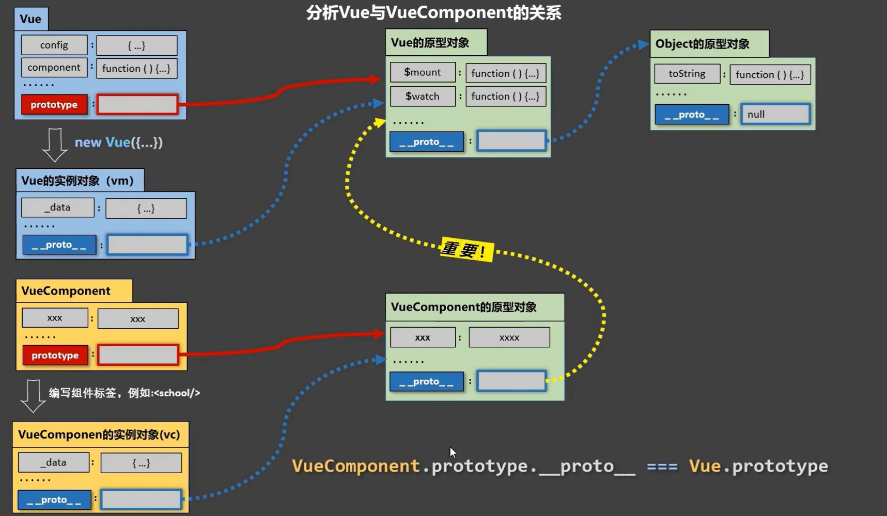

# 一、什么是组件化编程

```markdown
1. 组件就是'应用中局部功能和代码以及资源的集合',就是一个html,css,js,视频,音频等资源的复合体.
```




# 二、模块化与组件化的思想

```markdown
1. 模块化:就是把一个庞大的js文件拆分为多个小型js文件,安装模块化的方式对外暴露接口与引入.使用了这种思想的引用叫模块应用

2. 组件化:把一个应用分为多个组件,每个组件都又自己的html,css,js,资源,多个组件拼接起来就组成了一个应用.这个应用就是组件化以应用


⭕⭕⭕⭕⭕⭕⭕⭕⭕⭕
*组件化与模块化的结合:
 	在一个组件中,它的js文件可能非常大,此时可以按照模块化的思想把该组件的js文件拆分为多个小型js文件.但不管拆分为多少个js文件,它的目标都是为当前的组件服务.

```


# 三、Vue中的组件化-非单文件组件

- 非单文件组件:一个文件中包含n个组件,这就叫做非单文件组件,以`.html`结尾
- 单文件组件:一个文件中只包含一个组件,以`.vue`结尾

## ①非单文件组件的使用

```markdown
1. 创建组件 Vue.extend({})
	*传递的配置项与vm中一样,只有el不要,因为所有的组件都是交给vm管理的,vm中的el决定了哪个容器
	*data必须写成函数,避免组件被复用时,多个组件的数据指向一个对象.写出函数就是每个组件都有独立的数据对象
	*使用template可以配置组件结构

2. 注册组件 
		*局部注册:   在new Vue()中传入compents配置项
		*全局注册:   Vue.compents('组件名',组件)

3. 使用组件

4. 注意点:
	*组件名:单个单词首字母大写,多个单词使用大驼峰.`.vue`文件也一样
	
	*组件的name属性:组件创建好注册之后,注册的是什么名字在vue开发者工具中就是什么标签,如果这个组件被多个人注册,并且名字都不同,就容易出现歧义,此时可以用name属性来规范组件解析后的标签名
	
	*组件使用时不建议使用自闭盒标签,虽然他在cli环境下可用
	

5. 简写方式
const x = Vue.extend(option) ============>   const x = option
```

```html
<div id="vm">
    <!-- 3. 使用组件 -->
    <school></school>
    <hr>
    <student/></student>
</div>

<script>
    //1.创建组件
   const school = Vue.extend({
      template:`
       <div>
            <h1>{{schoolName}}</h1>
            <h1>{{schoolAddr}}</h1>
        </div>
      `,
    data(){
        return {
            schoolName:"xxx学校",
            schoolAddr:"xxx街道"
        }
    },
   })
   
   const student = Vue.extend({
        template:`
           <div>
                <h1>{{studentName}}</h1>
                <h1>{{studentAge}}</h1>
            </div>
        `,
        data(){
            return {
                studentName:"Lucy",
                studentAge:19,
            }
        }
   })

   new Vue({
    el:"#vm",
    //2. 注册组件
    components:{
        school:school,
        student:student,
    }
   })
</script>
```

## ②组件的嵌套使用

```markdown
*组件嵌套使用,由vm实例管理所有组件很麻烦,所以定义了一个顶级组件app,这个组件注册所有的组件.然后再由vm去注册app.这个是标准开发流程,组件的嵌套与不嵌套的使用语法是一样的,见下列代码
```

```html
<div id="root">
</div>


<script>
	//作为school的子组件,子组件需要写字父组件的上方,否则无法解析到子组件
    const student = {
        name:"student",
        data(){
            return {
                studentName:"Lucy",
                studentAge:18,
            }
        },
        template:`
            <div>
                <h1>{{studentName}}</h1>    
                <h1>{{studentAge}}</h1>    
            </div>
        `,
        
    }
    
    const school = {
        name:"school",
        data(){
            return {
                schoolName:"广州大学",
                schoolAddr:"广州市",
            }
        },
        template:`
            <div>
                <h1>{{schoolName}}</h1>    
                <h1>{{schoolAddr}}</h1>
                <hr>    
                <student></student>
            </div>
        `,
        components:{
            student
        }

    }
    
    const city = {
        name:"city",
        data(){
            return {
                cityName:"北京市",
                cityAddr:"地址在北京"
            }
        },
        template:`
            <div>
                <h1>{{cityName}}</h1>
                <h1>{{cityAddr}}</h1>
            </div>
        `,
    }
    
    //定义一个顶级组件app管理所有的组件
    const app = {
        components:{
            school,city
        },
        template:`
           <div>
                <school></school>
                <city></city>
            </div>
        `,
    }

    const vm = new Vue({
        el:"#root",
        //vm管理顶级组件app
        components:{
            app,
        },
        template:`<app></app>`
    })
</script>
```


# 四、组件详解✨

## ①什么是组件

```markdown
1. 组件的本质

	*组件的本质就是一个名字叫VueCompent的构造函数,在Vue.extend()中定义了这个构造函数并且返回了.
	
	ƒ VueComponent(options){
	  this._init(options);
    }
    
 
 2. VueComponent构造函数
 
 	*每次调用Vue.extend(),都会返回一个全新的VueComponent构造函数✨✨✨！！！！！
 
    *证明:每调用一次Vue.extend(),在该方法中都会定义一个全新的Sub变量接收VueComponent构造函数,最后返回了Sub

```



```markdown
 3. 组件实例的创建

	*我们只需要使用组件标签。在解析模板时Vue就会帮我们调用VueComponent构造函数创建该组件的实例对象
	
	*解释:当执行Vue.extend()得到VueComponent构造函数之后组件实例并没有创建,而是使用组件标签之后Vue才帮我们执行了这个构造函数,即:new VueComponent(options)得到组件实例.
	
	
4. this的指向
	*new Vue(options):this都是指向vm实例对象
	
	*组件配置中:this指向的是当前组件实例对象

```


## ②Vue与VueComponent的关系

```markdown
1. vc与vm简介

	(1)Vue与VueComponent都是一个构造函数

	(2)VueComponent实例对象简称vc

	(3)Vue实例对象简称vm
   
	(4)所有的 vc在vm.$childern中都存在
	
	
2. vc与vm的异同
 
 	(1)vc是可复用的Vue实例,它与new Vue()接收相同的配置选项,另外它们的生命周期回调函数和作用也一样,
 	
 	(2)不同的是vc没有el配置项,因为el是由vm决定的,而vc是交给vm管理的
		
```

```markdown
3. Vue与VueComponent的原型链关系
 
	*实例的隐式原型属性永远指向其构造者的原型对象
	
	vc原型对象的原型对象是vm的原型对象:目的就是让vc组件可以访问到vm上的属性与方法
```




# 五、Vue中的组件化-单文件组件

- 单文件组件就是以`.vue`结尾的文件,但是浏览器并不能识别该文件,需要进行处理之后才能运行在浏览器上,可以两种方式进行处理
  1. 使用webpack自定义整个处理`.vue`文件的工作流
  2. Vue-cli.官方提供的基于webpack的一套处理`.vue`文件的工作流  
- 一个标准的`.vue`组件的写法

```vue
<template><!-- 这里写组件的模板结构 -->

	/*必须要有根元素,template不是根元素,解析时会忽略这个标签*/
	<div>
        <h1 class="demo"></h1>
        <h2></h2>
    </div>

</template>


<script>/* 这里写组件的交互,如data,methods,component,watch....*/ 

    /*
    1. Vue.extend({}) 可以省略为{}
    2. 因为组件是需要给别人用的,所有需要暴露export
    */
    export default{
        //这里是组件名,与文件名一致
        name:"Chapter01",
        data(){
            return {}
        },
        
        methods:{}
    }
</script>


<style>/* 这里写样式组件的 */
    .demo{color: #bfa;}
</style>
```

- 一定要有一个顶级组件`App`,在顶级组件中引入其他组件进行注册使用


# 六、组件化的编码流程

## ①第一步：实现静态组件页面

```
（1）拆分组件：按照功能点拆分，如果拆分的组件不好取名字，说明拆分的不合理

（2）实现页面：根据组件的拆分实现静态页面效果,只考虑结构与样式，不考虑交互与数据
```

## ②第二步：展示动态数据

```markdown
==================这一步主要就是确定动态页面上的数据==================

(1)确定数据的'名称'，'类型'与'存储结构'。🐑🐑🐏

  *确定核心数据，即'数据驱动视图渲染'的这个数据，通俗点说就是需要传到服务器或者从服务器获取的数据

  *确定辅助数据，操作核心数据的过程中需要定义数据来辅助操作核心数据。例如把核心数据展示到弹窗中，定义一个辅助变量来
控制弹窗是否显示，这就叫做辅助数据，通俗点说就是不与服务器打交道的数据

  *确定数据的结构，为一个对象？或者式对象中套对象，套集合？（这一步最重要）

  *一个页面看起来似乎每个组件都要定义很多数据，但实际上都是对某个核心组件数据的操作，其他组件的数据只不过是来辅助操作这些核心数据的，有时候甚至可以通过对核心数据的巧妙操作而不需要定义辅助数据（🎇🎆🎇🎇🎉✨✨）


(2)确定数据的存储位置，哪个组件用就保存在哪里

  *对于'用'的解释：用不仅仅是读的操作，还包括写

  *多个组件用，放在父组件中，一个组件用，放在本组件中（定义辅助数据也要遵循这个规则）
```


## ③第三步：绑定事件

```
===============这一步主要是绑定事件，操作数据===============

（1）数据在哪里，操作数据的函数就在哪里

（2）事件的操作围绕核心数据，在这个过程中，可能会需要一些定义一些辅助数据来操作核心数据，在定义辅助数据之前思考是否能通过巧妙操作核心数据的方式从而不定义辅助数据。
	
```

## ④其他

```markdown

*一个输入类型的节点，有初始值展示，还要有交互修改值，就可以使用v-model绑定计算属性的完整写法get，set

** 数据驱动页面的展示 **	

```


# 七、组件的自定义事件

## ①事件给谁用

```markdown
1. 内置事件
	*Js原生的事件是给html标签用的，只不过在Vue中绑定的形式和语法不同，如@click,但是最终使用的还是Js的click事件

2. 自定义事件
	*自定义事件是用在组件标签上的，会给所在的组件实例对象'vc'绑定这个事件
	
	*事件绑在哪个组件身上，就去哪个组件中触发事件。
	
	*如果需要解绑，同理，在哪个组件身上绑定的事件，就在哪个组件中写解绑的代码
		this.$off([事件1,事件2,事件3])
```

## ②组件通信

```javascript
1. 使用函数方式实现子传父
            
         //父组件   
		<Student :getStudentNameFromStudentByFunc="getStudentNameFromStudentByFunc"></Student>
         getStudentNameFromStudentByFunc(studentName){
            alert(studentName)
          },
          
         //子组件  
         <button @click="sendStudentNameToApp">发生学习姓名到App</button>
		props:["getStudentNameFromStudentByFunc"],
		sendStudentNameToApp(){
             this.getStudentNameFromStudentByFunc(this.studentName)
         }


2. 使用自定义事件完成子向父传递数据

		//父组件
        <Student @atguigu="getStudentNameFromStudentByEvent"></Student>
        getStudentNameFromStudentByEvent(studentName,...param){
             alert(studentName)
         }

		//子组件
		sendStudentNameToApp(){
              this.$emit("atguigu",this.studentName,x,y,z)
         }
	   


3. 使用ref完成子传父
*第二个与第三个相比：第二个是在组件标签中就完成了事件的绑定，而第三种方法种是在函数中完成绑定，更加灵活

		//父组件
        <Student ref="student"></Student>

    	getStudentNameFromStudentByRef(studentName){
                this.mes = studentName
         }

		mounted(){
            /*大坑🏓🏑🏏🥋：注意回调函数这里不能直接写普通函数，因为里面的this是触发事件的组件实例对象，如果一定要写函数那么就写成箭头函数*/
            this.$refs.student.$on('atguigu',this.getStudentNameFromStudentByRef)
        }


		//子组件
		sendStudentNameToApp(){
             this.$emit("atguigu",this.studentName) 
         }


4. 全局事件总线
*使用全局事件总线可以完成任意组件之间的通信


5. 消息订阅与发布可以完成任意组件之间的通信（原理就是全局事件总线）


6.Vuex可以完成任意组件间的通信

7.路由传参
```

## ③如何给组件标签绑定原生事件

```html
*在‘事件给谁用’中讲过，组件标签只能绑定自定义事件，即使绑定了原生事件，Vue也认为是一个自定义事件，需要在子组件中用$emit来触发
    //Vue会认为这是一个自定义事件，只能在Student子组件中触发该事件
    <Student ref="student" @click="showMsg"></Student>	


*给组件绑定原生事件,native会把事件绑定在组件最外层的元素上
    <Student ref="student" @click.native="showMsg"></Student>	

    showMsg(){
        console.log("在父组件中的事件调用函数");
    },  
```

