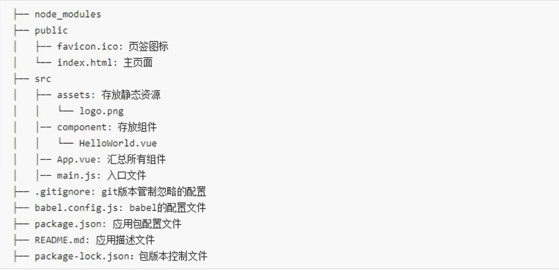

# 一、使用cli创建Vue项目

```markdown
1. 需要先安装node.js

2. 安装vue_cli

	npm install -g @vue/cli
	
3. 使用vue_cli创建vue项目
	
	vue create my-project
	
4. 进入项目所在的文件夹

	npm run serve
	
	
*补充:如果安装的很慢,需要配置淘宝镜像
```

# 二、结构分析

## ①结构




## ②render函数

```markdown
主要是版本问题

1. vue.js与vue.runtime.xxx.js的区别
	（1）vue.js是完整版的vue，包含vue核心 + 模板解析器
	（2）vue.runtime.xxx.js是运行版的vue，只包含vue核心，没有模板解析器

2. vue_cli在main.js中默认导入的是vue.runtime.xxx.js版本，所以不能使用template标签，需要使用render函数接收
	到createElement函数然后去html中指定具体内容
	
3. 为什么`.vue`文件中可以使用template？
	*因为vue_cli导入了一个编译器，专门解析.vue文件的template
	*main.js是一个js文件，不导入完整版的vue.js就无法解析template
```


## ③修改Vue的默认配置

```markdown
*使用vue inspect > output.js 可以查看Vue_cli的默认配置，（看到的是副本，并不能改）

*在vue.config.js中修改，怎么修改可以在vue官网中看到：生态系统==>Vue Cli===>配置参考

*vue.config.js需要与package.json放在同一级目录下
```


