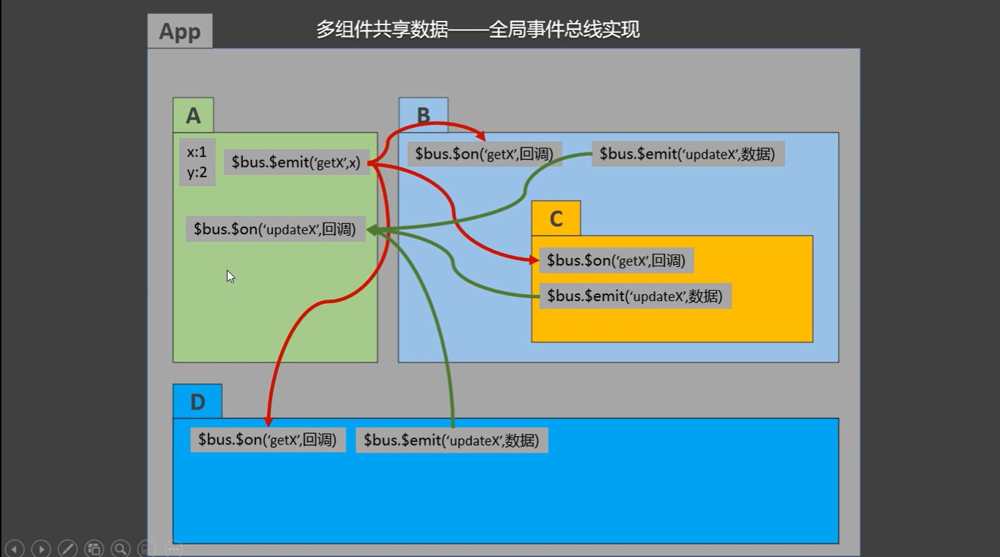

# 一、全局事件总线介绍

```markdown
*全局事件总线可以实现任意组件之间的通信，全局事件总线其实就是一个vc或者是vm
 
 
*什么样的组件能当全局事件总线？
（1） 所有组件都能看到这个组件

（2）这个组件中有$on,$emit,$off方法，分别用来绑定事件，触发事件，和解绑事件。如果没有这三个API，即使所有组件能看见
这个组件也是无济于事，因为无法绑定事件与触发事件。


```

# 二、全局事件总线的原理

```javascript
main.js
=======================================================
//创建VueComponent的组件实例对象vc，因为vc的原型是vm，而vm中有$on,$emit,$off方法
const x = new (Vue.extend({}))
//把这个实例对象放在Vue的原型上，这样vm和所有vc就能访问了
Vue.prototype.x = x;

new Vue({
    components:{
        App,
    },
    render:h=>h(App),
    
}).$mount('#app')


组件Student，接收数据的一方
==========================================================
mounted() {
    //这里的this是当前实例即Student，在自己中找不到x,会去原型中找，最后一直找到vm，所以可以直接this.x
    //给组件实例对象x绑定一个事件demo，在x上找不到$on,会去原型中找，而原型是vm，所以找到了
    this.x.$on('demo',(value)=>{
        console.log(`Student组件接收到了数据,数据是：${value}`);
    })
},
    
    
组件School，传递数据的一方
==========================================================
methods:{
    //触发组件实例对象x的事件demo，因为demo事件的回调是在Student中，所以可以把数据传递到Stuent中。
    sendDataToStudent(){
        this.x.$emit('demo',66666)
    }
}
```


# 三、标准全局事件总线


```javascript
main.js
=======================================================

new Vue({
    components:{
        App,
    },
    render:h=>h(App),
    //在数据代理监听产生之前给Vue.prototype添加一个全局事件总线vm，取名叫做$bus
    beforeCreate() {
        Vue.prototype.$bus = this;
    },
    
}).$mount('#app')


组件Student，接收数据的一方
==========================================================
🎈🎈🎈🎈🎈🎈🎈给$bus绑定自定义事件，因为回调在这，其他组件触发该事件所以可以在本组件中获取其他组件传递的数据🎈🎈🎈🎈🎈🎈🎈
mounted() {
    this.$bus.$on('demo',(value)=>{
        console.log(`Student组件接收到了数据,数据是：${value}`);
    })
},
    
    
🎈🎈🎈🎈🎈🎈🎈注意，接收数据的组件被销毁时，需要解绑$bus（即vm）身上该组件所使用的事件🎈🎈🎈🎈🎈🎈🎈
beforeDestroy(){
    this.$bus.$off('demo')    
    //注意，千万不要直接this.$bus.$off(),这相当于把$bus(vm)身上的所有自定义事件全部干掉了，别的组件也无法使用
}    
    
    
组件School，传递数据的一方
==========================================================
//在组件中触发$bus的demo事件，并传递参数过去，因为demo事件的回调是在Student中，所以Student会得到参数
methods:{
    sendDataToStudent(){
        this.$bus.$emit('demo',66666)
    }
}


```


# 四、全局事件总线的缺点



```
使用全局事件总线完成组件的共享数据的操作，虽然可以实现，但是会显的特别乱，如上图，四个组件对x,y两个数据进行读写操作，却在四个组件中写各种$emit，$on。现在只是四个组件，如果有几十个组件，十几个数据，那么操作起来会显得十分繁琐。

```

***①只有少量的组件，操作少量的共享数据；或者是操作组件中独有的数据，如辅助数据的传递，此时可以使用全局事件总线。**

***②但是如果共享的数据特别多，操作这些数据的组件也多，就使用vuex**

