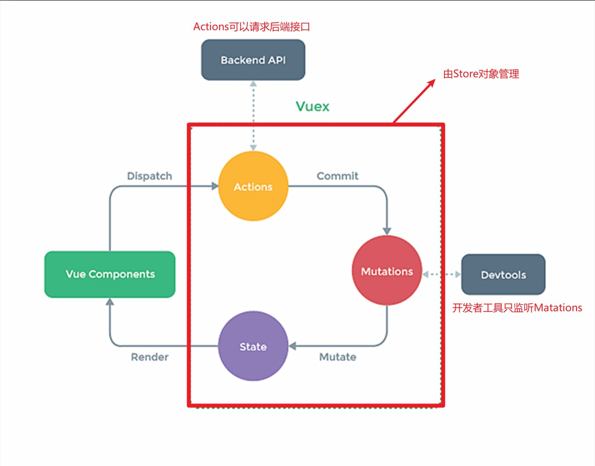

# 一、Vuex是什么

```markdown
*Vuex是一个专门用来做数据集中管理的一个插件 （数据即状态）

*可以对Vue中多个组件共享的数据进行统一的读写操作

*也是一种组件间通信的方式，它适用于任意组件之间的通信
```

# 二、Vuex实现任意组件通信

## ①全局事件总线操作多组件共享的数据


- 使用全局事件总线完成组件的共享数据的操作，虽然可以实现，但是会显的特别乱，如上图，四个组件对x,y两个数据进行读写操作，却在四个组件中写各种$emit，$on。现在只是四个组件，如果有几十个组件，十几个数据，那么操作起来会显得十分繁琐。


## ②Vuex操作多组件共享的数据


## ③Vuex的使用场景

```markdown
1. 多个组件依赖于同一个数据

2. 不同组件的操作改变的是同一个数据
```


# 三、Vuex工作原理

## ①Vuex的四个对象和Store

```markdown
*State
  对象类型。主要用来保管数据

*Actions
  对象类型。存储键值对，store.dispatch的执行会引起Actions的执行。主要是分发对数据的操作,可以请求后端接口，如要修改State中的一个值，但是修改后的值需要请求服务器才知道，此时就可以在Actions中发送请求，得到数据后再进行下一步操作

*Mutations
   对象类型，存储键值对，store.commit的执行会引起Mutations的执行。主要是执行对State数据的操作。接收到Actions分发的操作后具体的执行者

*Getters
   对象类型，存储键值对，用于将State中的数据进行加工。里面配置多个函数，类似计算属性，也是有返回值，用的时候也是写函数名。计算属性只能在单文件中使用，而getters中的函数可以在所有共享它的组件中使用
   
*Store
   对象类型，所有的State，Actions，Mutations，Getters都是在Store对象中。所有函数的调用都是通过Store
```


## ②Vuex的执行流程

```markdown
*Actions执行
   在组件中调用store.dispatch('add',value)会引起 Actions中key为add的函数调用,Actions中的add函数有两个参数，一个是store对象，一个是接收到的value。这个函数调用就会拿到dispatch传过来的value


*Mutations执行
   在Actions中，add函数体内，程序员需要手动调用store.commit('add',value)，而此时会引起Mutasions中key为add的函数调用
Mutasions中的add函数会拿到两个参数，一个是state，一个时commit时的value，此时对数据进行操作，操作完成之后render重新解析模板渲染视图

```


## ③Vuex的使用

```markdown
 1. 安装Vuex并导入（Vue2用Vuex3，Vue3用VUex4）
 
 2. Vuex.use(vuex)，use之后vm就可以传递一个全新的配置项store
 
 3. 创建store对象，store中包含actions，mutations，state,getters。然后把store对象传给vm的store配置项
 
 - 注意：import导入会有语句提升的问题，所有的import到会提升到最上方


*在组件中是可以直接调用commit然后交给Mutations执行的，前提是value十分确定,并且不需要请求后端接口，如果value不确定，就只有调用store.dispatch中然后Actions执行，在Action中请求后端数据。接着一步一步往下走


*没有业务逻辑的时候，可以在组件中直接调用store.commit，如果有业务逻辑，如要计算、请求接口的时候就不能直接在组件中使用store.commit，需要在Actions中处理业务逻辑，由Actions调用commit。

 -- Actions接收参数，处理逻辑，调用commit
 
 -- Mutations不做任何逻辑处理，只专心操作数据


```



```javascript
import Vuex from 'vuex';
import Vue from 'vue';
Vue.use(Vuex);

const actions = {
	//定时器模拟请求接口的业务逻辑
    incrementWait(miniStore,value){
        setTimeout(()=>{
            miniStore.commit('INCREMENT',value)
        },1000)
    }
}

const mutations = {
    INCREMENT(state,value){
        state.sum += value
    },
} 
const state = {
    sum : 10,
};

const getters = {
    bigSum(state){
        return state.sum * 10
    }
}

export default new Vuex.Store({
    actions,mutations,state,getters
})


================================组件的js代码中调用Store================================
incrementWait(){
    this.$store.dispatch('incrementWait',1)
},
```


## ④mapState与mapGetters

```javascript
*主要的作用是映射store中的state与getters在组件中使用

*mapState，映射state的数据为计算属性

*maoGetters，映射getters的数据为计算属性
    
========================================vuex代码==================================================
const state = {
     sum : 10,
     school:'广州大学',
     subject:'软件工程',
};

const getters = {
      bigSum(state){
      return state.sum * 10
   }
}


========================================组件js代码==================================================
    
import {mapState,mapGetters} from 'vuex'

computed:{
    //使用扩展运算符展开之后就是一个个计算属性
    ...mapState(['sum','school','subject']),
	
    ...mapGetters(['bigSum']),
},
    
    
 <h1>{{sum}}</h1>
 <h1>{{school}}</h1>
 <h1>{{subject}}</h1>
 <h1>{{bigSum}}</h1>
```


## ⑤mapActions与mapMutations

```markdown
*主要的作用是生成与store中的Actions，Getters对话的methods

*mapActions：帮我们生成与Actions对话的methods，即生成包含this.$store.dispatch()的函数

*mapMutations：帮我们生成与Mutations对话的methods，即生成包含this.$store.commit()的函数
```

```javascript
    
======================================store=================================================

const mutations = {
    INCREMENT(state,value){
        state.sum += value
    },

    DEINCREMENT(state,value){
        state.sum -= value
    },
} 
    
const actions = {
    increment(miniStore,value){
        miniStore.commit('INCREMENT',value);
    },
    deincrement(miniStore,value){
        miniStore.commit('DEINCREMENT',value);
    },
    incrementOdd(miniStore,value){
        if(miniStore.state.sum % 2) {
            miniStore.commit('INCREMENT',value)
        }
    },
    incrementWait(miniStore,value){
        setTimeout(()=>{
            miniStore.commit('INCREMENT',value)
        },1000)
    }
}


const state = {
    sum : 10,
};


======================================vue的js代码=================================================
import {mapActions,mapMutations} from 'vuex'
methods:{
	    ...mapMutations(['INCREMENT','DEINCREMENT']),//数组写法，对象写法省略
           
         //mapMutations会生成如下代码
            
        /* 
        INCREMENT(value){
             this.$store.commit('INCREMENT',value);
         },
         
        DEINCREMENT(value){
            this.$store.commit('DEINCREMENT',value);
        },
        */
            
            
        //================================================================
            
            
            
        ...mapActions(['incrementOdd','incrementWait']),//数组写法，对象写法省略
            
		//mapActions会生成如下代码
            
        /* 
        incrementOdd(value){
             this.$store.dispatch('incrementOdd',value)
         },
         
        incrementWait(value){
            this.$store.dispatch('incrementWait',value)
        },
        */
},
  

=======================================vue模板================================================
<button @click="INCREMENT(count)">+</button>
<button @click="DEINCREMENT(count)">-</button>
<button @click="incrementOdd(1)">当前和为奇数时再加一</button>
<button @click="incrementWait(1)">等一等再加一</button>
```


# 四、Vuex的模块化+命名空间

```markdown
*如果不使用模块化，那么所有模块的，所有共享数据全部放在一个js文件中，后期难以维护。

*根据一个功能，或者是根据某几个组件共享的数据来划分模块，每个模块都有自己的Actions，Mutations，State，Getters

```

`store/index.js`

```javascript
import Vuex from 'vuex';
import Vue from 'vue';
import {nanoid} from "nanoid" 
Vue.use(Vuex);


//这是Count模块
const countOption = {
    namespaced:true,//命名空间必须开启
    state:{
        sum : 10,
        school:'广州大学',
        subject:'软件工程',
    },
    actions:{
        increment(miniStore,value){
            miniStore.commit('INCREMENT',value);
        },
        deincrement(miniStore,value){
            miniStore.commit('DEINCREMENT',value);
        },
        incrementOdd(miniStore,value){
            if(miniStore.state.sum % 2) {
                miniStore.commit('INCREMENT',value)
            }
        },
        incrementWait(miniStore,value){
            setTimeout(()=>{
                miniStore.commit('INCREMENT',value)
            },1000)
        },
    },
    mutations:{
        INCREMENT(state,value){
            state.sum += value
        },
        DEINCREMENT(state,value){
            state.sum -= value
        },
    },
    getters:{
        bigSum(state){
            return state.sum * 10
        }
    },
}


//这是Person模块
const personOption= {
    namespaced:true,
    state:{
        personList:[
            {id:'001',name:'Lucy'},
            {id:'002',name:'Kaka'},
        ]
    },
    actions:{
        addPerson(miniStore,value){
            const person = {id:nanoid(),name:value};
            miniStore.commit('ADD_PERSON',person);
        }
    },
    mutations:{
        ADD_PERSON(state,person){
            state.personList.unshift(person);
        },
    },
    getters:{},
    
}


//所有的模块都可以单独抽取变为一个js文件，然后再index中导入，这里没有这样做，但是要知道可以


export default new Vuex.Store({
    modules:{
        a:countOption,
        b:personOption
    }
})

```

`Count组件`

```vue
/* 使用模块化之后，借助namespaced读取模块中的属性，但是前提时该模块开启了namespaced：true */

<script>
    import {mapState,mapGetters} from 'vuex'
    import {mapActions,mapMutations} from 'vuex'
    export default {
        name:'Count',
        computed:{
            //映射模块a中state的'sum','school','subject'属性为计算属性
            ...mapState('a',['sum','school','subject']),
            
             //映射模块b中state的'personList'属性为计算属性
            ...mapState('b',['personList']),
			
            //映射模块a中getters的bigSum为计算属性
            ...mapGetters('a',['bigSum'])
        },
        methods:{
            
            //映射模块a中Mutations的INCREMENT，DEINCREMENT方法为methods
            ...mapMutations('a',['INCREMENT','DEINCREMENT']),
            
            
            //映射模块a中Actions的incrementOdd，incrementWait方法为methods
            ...mapActions('a',['incrementOdd','incrementWait']),
        },
        data(){
            return {
                count:1,
            }
        },
    }
</script>


==========================================================================================================


/* 使用模块化之后，不使用namespaced，自己写计算属性读取 简单举几个例子*/

<script>
    import {mapState,mapGetters} from 'vuex'
    import {mapActions,mapMutations} from 'vuex'
    export default {
        name:'Count',
        computed:{
            //读取a模块state的数据a
            sum(){
                return this.$store.state.a.sum;
            }
            
            //读取a模块getters的属性bigSum
            bigSum(){
         		return this.$store.getters['a/bigSum']
    	   }
        },
        
        methods:{
            //读取a模块Actions中叫incrementOdd的方法
            xxx(){
                this.$store.dispatch('a/incrementOdd',value)
            }
            
             //读取a模块Mutations中叫INCREMENT的方法
            xxx(){
                this.$store.commit('a/INCREMENT',value)
            }
           
        },
        data(){
            return {
                count:1,
            }
        },
    }
</script>
```

