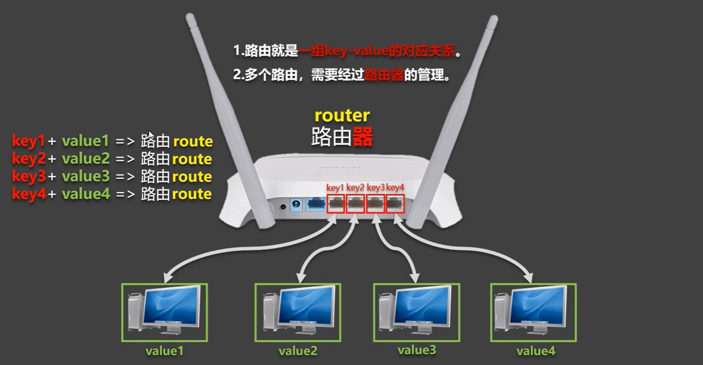
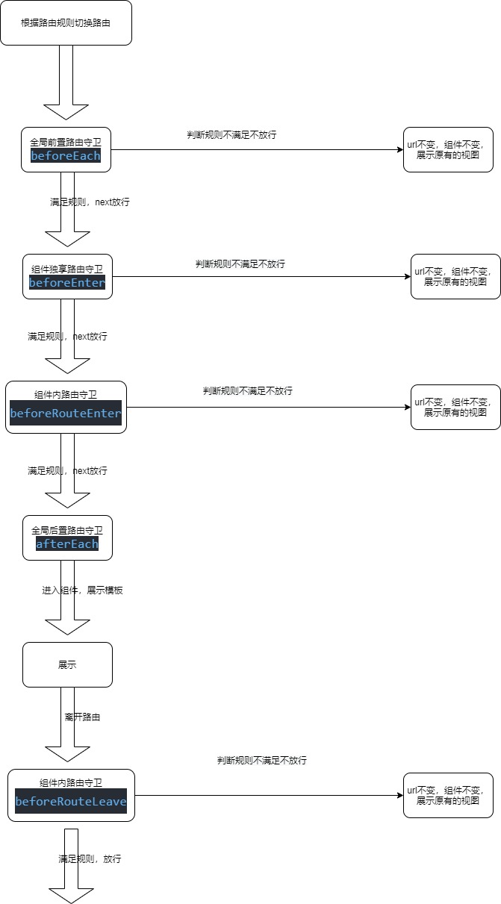

# 一、路由简介

## ①理解路由 

```markdown
*路由就是一组key-value的对应关系，所有的路由（route）都要路由器（router）管理。


*对于前端来说key就是路径，value就是组件，不同的操作产生不同的路径，根据路径找到对应的组件并展示页面。这一组对应关系就称之为一个'路由'或'路由规则'，N多个'路由规则'交给Vue的路由器管理


*Vue中的路由主要的作用是做单页面应用，SPA（sington page application），路由器（router）会时刻监测路径的变化，总是会根据不同的路径在同一个页面中展示不同的效果，


前端路由：path ==============>   component 

后端路由：path ==============>   function  如url与controller的映射关系

```




## ②对单页面应用的理解

```markdown
*单页web应用，整个web应用只有一个页面

*点击页面中的导航连接不会刷新页面，只会做页面的局部更新

*数据需要通过ajax异步请求来获取，不同能过同步请求获取，同步请求总是实现页面的全局刷新
地址栏，表单，超链接都是同步请求，全局刷新 

```


## ③Vue-router的使用

```markdown
*路由只是一种思想，做单页面应用SPA的一种思想，如果想要在Vue中使用这种思想完成单页应用，落地的代码需要由Vue-router插件库来实现
 
 使用方式
 *安装并导入vue-router （Vue3用Vue-router4，Vue2用Vue-router3）
 *导入Vue-router，并且use，之后就可以在vm中传递一个全新的配置项router。
 *创建一个router对象传入传给vm的router配置项。和store一个套路


*实现路由切换用router-link，它会转换成a标签，active-class属性监视router-link样式，点哪个 router-link，谁就用这个样式。
 to指定切换的路由它的key

*实现路由对应组件的展示用router-view

```

## ④Vue-router的注意点

```
*路由中组件的分类
一般组件：需要在组件的模板中使用组件标签的就是一般组件，它不需要路由规则。  放在components文件夹中

路由组件：靠路由规则匹配，由路由器渲染的组件就叫做路由组件			   放在pages||views文件夹中


*切换路由组件重新渲染视图后，之前的路由组件会被销毁

*使用路由之后，所有组件会多出两个属性
   *$route：  每个路由组件实例的$route都是不同的，存储的是自己的路由信息
   
   *$router： 每个路由组件实例的$router都是相同的 。一个应用一个$router。
   
```

***Vue-router的工作原理***

> 当进行路由切换时，会导致url路径的改变。router时刻监听路径，发现路径改变，然后匹配该路径对应的组件进行展示


## ⑤嵌套路由

```javascript
*嵌套路由就是多级路由

*在配置中，一级路由的子路由path不能写'/',加上会无法识别，Vue会自动加。子路由在使用的时候需要加上父路由的路径


<router-link class="list-group-item" active-class="active" to="/home/message">Message</router-link>
	
{
	path:'/home',
	component:Home,
	children:[
		{path:'news',component:News},
		{path:'message',component:Message},
    ]
},
```


# 二、路由传参

## ①路由命名

```markdown
=====================🖼🖼🖼🖼🖼🖼🖼🖼🖼作用是简化路由的跳转路径🖼🖼🖼🖼🖼🖼🖼🖼🖼=====================

* 给路由起名
	-name:路由名


* 根据路由名进行路由跳转
	:to={name:路由名}		===>		用来替代path:/xxxx/xxx，如果是多级路由写path就太长了,用name简化,
```


## ②query参数

```vue
（1）query参数，与axios的query一样，都是直接在路径上进行拼接的参数。即'abc?id=x&title=x'

（2）父路由传递的所有query参数在接收参数的子路由中都可以收到，$route.query

（3）使用to的字符串，对象写法接收query参数

1. 字符串写法传递query参数
/*在html中不能写js，也就不能写``，所以使用':to'告诉Vue这是一个js表达式，这样就可以使用``了*/
<router-link :to="`/home/message/details?id=${m.id}&title=${m.title}`">{{ m.title }}</router-link>


2. 对象写法传递query参数
<router-link :to="
{
	path:'/home/message/details',
	query:{id:m.id,title:m.title}
}"
>
{{ m.title }}
</router-link>


3. 接收query参数
<ul>
    <li>{{$route.query.id}}</li>
	<li>{{$route.query.title}}</li>
</ul>

```

## ③params参数

```javascript
(1)params参数，就是restful风格的参数  即'xxx/id/title'

(2)父路由传递的所有param参数在接收参数的子路由中都可以收到，$route.param

(3)使用to的字符串，对象写法接收query参数

*首先在路由规则中配置占位符，声明接收的是params参数
{
    path:'details/:id/:title',
    component:Details,
}

1. 字符串写法传递params参数
<router-link :to="`/home/message/details/${m.id}/${m.title}`">{{ m.title }}</router-link>


2. 对象写法传递params参数
				************to的对象传递params参数只能用name，不能用path。语法规定************
<router-link :to="{
name:'detalis',
    params:{
        id:m.id,
		title:m.title
    }
}">
{{ m.title }}
</router-link>


3. 接收params参数
<li>{{$route.params.id}}</li>
<li>{{$route.params.title}}</li>


```

**query和params的选择：**`使用to的字符串写法传参就用param，使用to的对象写法传参就用query`


## ④路由的props配置

```javascript
*为什么用路由的props配置
	在接收参数的路由中，使用参数的地方都要使用$route.query.xxx或者$route.params.xxx,这样代码很冗余，通过props配置项解决


*路由的props配置三种写法

1. 函数写法传递props参数 有一个$route形参
{ 
	name:'detalis',
	path:'details/:id/:title',
	component:Details,
	props($route){
    	return {
			id:$route.params.id,
			title:$route.params.title,
        }
	}
}


3. 对象写法传递props参数
	props：{id:xxx,title:xxx}


2. 布尔值写法传递props参数
	props：true（这样写的化在组件中只能接收params参数）
    
*在Details组件中接收路由参数，以porps配置的形式传递的数据，路由组件中需要props接收才能使用

 props:['id','title']
```

# 三、编程式路由导航

## ① 两种路由的跳转方式

```markdown
(1)编程式路由导航进行路由跳转

(2)<router-link>进行路由跳转


*<router-link>路由跳转的缺点
	(1)<router-link>会转换成a标签，如果做路由跳转的html结构不是a标签，那router-link明显就不合适
	
	(2)<router-link>点击之后会立即切换路由，无法在跳转之前进行其他操作。
	
	(3)<router-link>需要用户点击才会切换，无法进行路由的自动切换。
```

## ②编程式路由导航的使用

**补充：浏览器的历史记录与栈结构一样，栈针指向当前浏览记录。有两种方对历史记录进行入栈操作：push，replace**

- push模式：把当前浏览记录入栈，不破整体坏浏览记录
- replace模式：当前浏览记录覆盖上一条浏览记录
- <router-link>默认为push，可以切换模式

```javascript
*编程式路由导航主要是通过$router（路由器）原型上的方法完成路由的跳转与浏览记录的前进后退

(1)页面跳转：进行页面跳转，并把跳转的这次浏览记录入栈
	push()
    replace()

(2)历史记录前进与后退：移动栈针，显示对应的页面
    back()
    foward()
	go()	=====>  自定义栈针移动几次，参数为正/负数


<button @click='pushShow(m)'>push跳转</button>
<button @click="replaceShow(m)">replace跳转</button>

//pushShow和replaceShow需要传递一个对象，传递的对象就是router-link标签中:to属性的对象
pushShow(m){
    this.$router.push({
        	name:'detalis',
        	params:{id:m.id,title:m.title}
	})
},
    
replaceShow(m){
	this.$router.replace({
			name:'detalis',
             params:{id:m.id,title:m.title}
	})
}
```

## ③缓存路由组件

```html
*缓存路由组件的作用：让不展示的路由组件保持挂载，不被销毁

*实现
<!-- include写的是组件名，不是路由规则中的name ，如果不写include，那么该位置的所有组件全部被缓存-->
<keep-alive include="News">
    <router-view></router-view>
</keep-alive>

缓存多个
:include="['News','Message']"

```

## ④路由组件独有的生命周期

```markdown
*作用：主要用在被缓存的路由组件身上
  路由被缓存之后，切换路由并不会触发beforeDestory,但是该路由需要在切换之前做一些释放资源的操作。此时就可以用路由的钩子函数

*activated()：路由被激活时调用

deactivated()：路由失活时调用（即路由组件切换时使用）

```

# 四、路由守卫

## ①路由守卫解决的问题

- *场景：进行路由切换时，需要根据条件决定是否展示这个路由，此时就可以使用路由守卫来解决

  

- *路由守卫可以控制路由的访问权限，类似后端的拦截器，所有条件通过后，才能访问路由

  

## ②全局路由守卫

> 全局路由守卫编写在路由规则中
>
> *全局前置路由守卫：页面初始化时，路由切换之前（也是url改变之前）调用，自定义放行规则
>
> *全局后置路由守卫：页面初始化时，路由切换完成之后调用
>
> *虽然每次切换路由都会执行前置路由守卫对应的函数，但是有时候对部分组件时不需要进行判断的，此时可以在meta中放入一个数据控制否需要进行判断

```javascript

/************************路由配置规则*************************/
const router =  new VueRouter({
    routes:[
        {
            name:'about',
            path:'/about',
            component:About,
        },
        {   
            name:'home',
            path:'/home',
            component:Home,
            children:[
                {
                    name:'news',
                    path:'news',
                    component:News,
                    meta:{isAuth:true}
                },
                {
                    name:'message',
                    path:'message',
                    component:Message,
                    meta:{isAuth:true},
                    children:[
                        {   
                            name:'detalis',
                            path:'details/:id/:title',
                            component:Details,
                            props({params:{id,title}}){
                                return {id,title}
                            }
                        }
                    ]
                },
            ]
        },
    ]    
})

===================================================================================================================
      

to：表示切换去的那个路由组件

from：表示当前路由组件，也就是被切换的路由

next：一个函数，调用之后就会放行，去到to路由组件


/************************全局前置路由守卫*************************/
router.beforeEach((to,from,next)=>{
    //切换到to组件之前那是否需要进行判断，不需要判断直接放行
    if(!to.meta.isAuth) {
        console.log('不需判断');
        return next();
    }

    console.log('需判断');
    //程序走到这里说明to组件需要判断，有isAuth这个属性，根据判断规则选择是否放行
    if(localStorage.getItem('school') === 'atguigu')  {
        console.log('判断条件成立，进行跳转');
        next();
    }else{
        console.log('判断条件不成立');
    }

})


/************************全局后置路由守卫*************************/
router.afterEach((to,from)=>{
    document.title = to.name
})
```


## ③独享路由守卫

> 独享路由守卫，编写在路由规则中
>
> *独享路由守卫，顾名思义就是某一个路由独有的路由守卫，独享路由守卫只有前置，没有后置
>
> *在切换到该路由之前执行独享路由守卫

​	

```javascript
{
	name:'news',
    path:'news',
    component:News,
    meta:{isAuth:true},
	//这是独享路由守卫的函数
    beforeEnter:(to,from,next)=>{
		console.log('进入独享路由守卫');
		next();
	}
},
```


## ④组件内路由守卫

> 组件内路由守卫，作用在某个在路由组件上，只不过规则编写在组件内(当作一个vc配置项)而不是路由配置文件中。
>
> 进入守卫：beforeRouteEnter'***通过路由规则***'进入组件之前被调用
>
> 离开守卫：beforeRouteLeave：'***通过路由规则***'离开组件之前被调用 

```javascript

    beforeRouteEnter(to,from,next){
      console.log('进入守卫beforeRouteEnter');
      next();
    },
    beforeRouteLeave(to,from,next){
      console.log('离开守卫beforeRouteLeave');
      next();
    }

```


## ⑤总结路由守卫执行流程




# 五、路由器的两种工作模式

## ① Hash模式

> *当使用vue-router之后，所有路由规则配置的路径在url中都会以'#'开头，#开始与后面的路径称之为hash值`http://localhost:8080/#/home/message`
>
> *hash值不会作为请求路径发送到服务器，以这条url举例，发送到服务器的路径就是`http://localhost:8080/`
>
> *hash模式是路由器的默认模式，可以在路由器配置中使用`mode:hash/history`进行更改
>
> 

## ②History模式

> *路径不会有#,所有路由匹配的路径全部都会当作一个资源去请求服务器，但是会出现404问题，因为服务器没有这个路径的资源`http://localhost:8080/home/message`
>
> *这个问题主要在服务器端解决。区分哪些是前端路由，哪些是后端路由，java有三方库可以解决这个问题，或者使用Nginx


